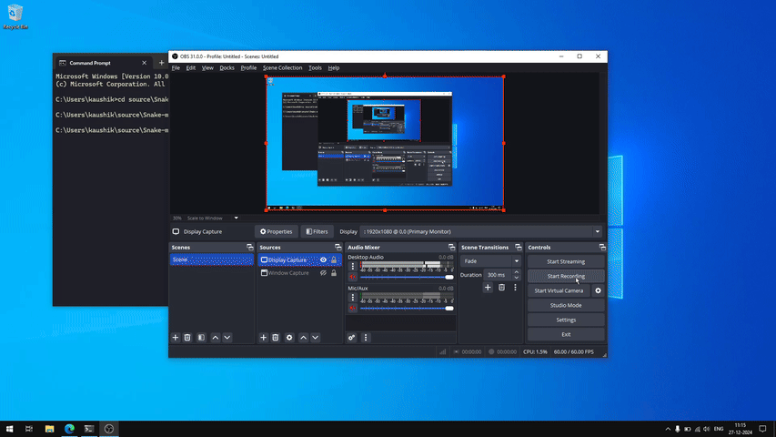

# snake
Basic snake game in C++  
Libraries used -  
- GLFW for window and events
- glm for math
- glad for loading OpenGL functions

Just a learning project can be improved in many ways.

# snake raylib version
Libraries used - 
- Raylib for everything
- Added textures

Textures are converted to include files and included in the source code so no need to have textures seperately.
main.cpp is old version and not used just there for archival purpose. Keep the raylib libraries and include 
files at appropriate position according to build script or modify the build script to build yourself.

